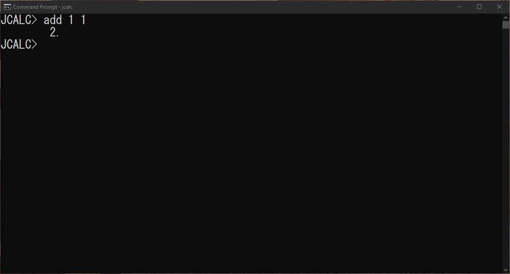

# jcalc
A cross-platform CLI calculator that allows one to make calculations in a hurry!  
  
**CURRENT VERSION:** *v1.0a*
  
  

## Platforms currently supported
- Windows (x86)
- DOS, and other 32-bit operating systems from the same family, such as OS/2 (x86)
- Linux (x86) and (x86-64)
- Linux (ARM32) and (ARM64)
- Linux (PowerPC 32-bit) and (PowerPC 64-bit)
- Linux (SPARC v9 64-bit)
- Mac OS X (x86) (ON DEVELOPMENT)
  
  
## Check out the wiki
**Look for "quickstart.md" on the wiki folder!** It has all the basic information on how to use the program.  
**Command file also included.** Check that out too!  
  
  
## Structure of this repository
- src/ - Location of the source code.
- no-unicode/ - Location of the source code for DOS or other platforms where Unicode is not available.
- wiki/ - Location of the wiki for the program. All the information you need!
  
  
## Future plans
\+ **Composition mode** - Use the normal operations as a instruction set for the program to run. You would be able to save it and run it later. 
   Example:  
     
   *Calculate kinectic energy 1/2 mv^2, knowing the mass is 10kg, and the velocity 10 m/s*  
      
      *predefine the variables, var0 = m, var1 = v*
      var0 10
      var1 10
      
      edit
      *enter composite mode*
      [LINE1] mul 0.5 var0
      [LINE2] pow var1 2
      [LINE3] mul %line1 %line2
      [LINE4] save kenergy               -> Gets saved in a file "kenergy.clc"
 
      *run the program later*
      run kenergy
            *the result gets displayed*
            
\+ **More language support**  
\+ **Programmer's tools**  
      
            
      
